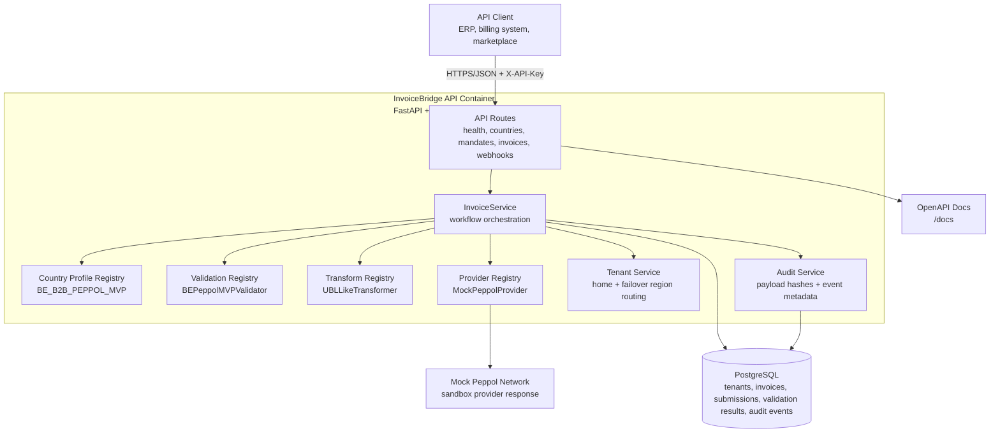
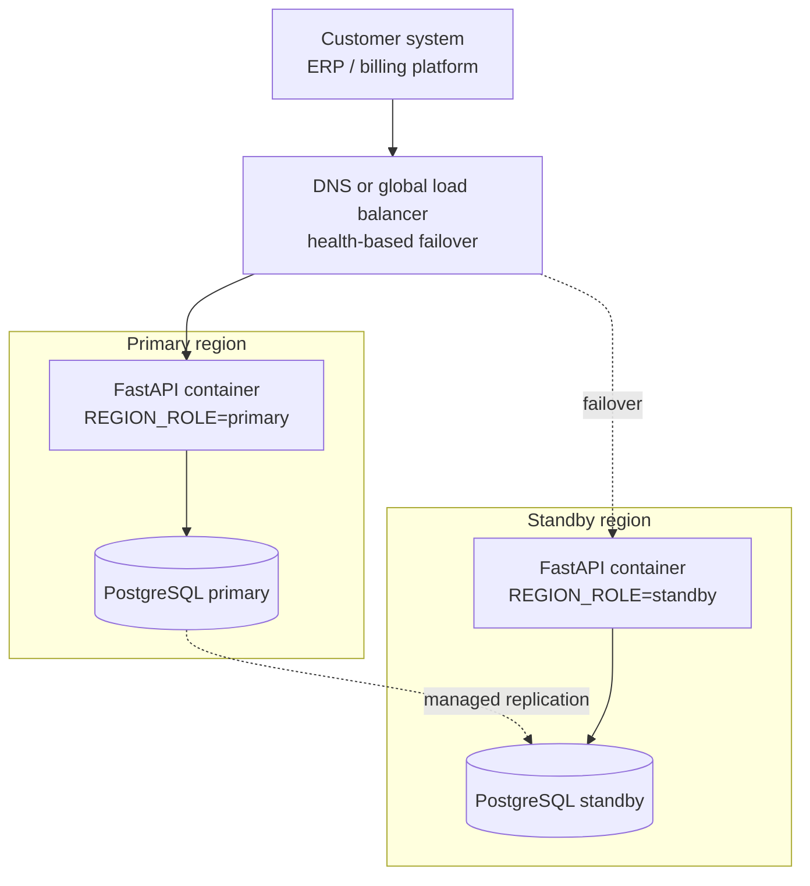

# Architecture

InvoiceBridge API is a modular FastAPI service for the e-invoicing compliance workflow: accept normalized invoice JSON, select a country mandate profile, validate compliance rules, transform valid invoices into sandbox UBL-like XML, submit through a mock network provider, track status, and persist an audit trail.

The MVP intentionally supports one jurisdiction/profile: Belgium B2B Peppol-style invoicing through `BE_B2B_PEPPOL_MVP`. The design keeps mandate rules, validators, transformers, and providers separate so additional countries or real network providers can be added without rewriting the HTTP API.

## C4-Style Container Diagram

## Multi-Region Shape

The API is now region-aware so a customer deployment can run the same container in more than one region without changing the request contract. The recommended production architecture is single-cloud multi-region, not multi-cloud by default.

Region support is intentionally simple and customer-facing:

- `DEPLOYMENT_REGION`, `REGION_ROLE`, `DATA_RESIDENCY_REGION`, `ACTIVE_REGIONS`, and `FAILOVER_REGION` configure runtime identity.
- `/health`, `/health/ready`, and `/v1/regions` expose regional status for load balancers, smoke tests, and customers.
- `/v1/tenants` stores tenant home-region, data-residency, and failover routing policy.
- Responses include `X-Deployment-Region`, `X-Region-Role`, and `X-Data-Residency-Region`.
- Invoice, submission, and audit records persist `tenant_id` and/or `processing_region` where applicable.
- Idempotency keys remain the retry-safety mechanism during failover.

More detail is in [multi_region.md](multi_region.md) and [cloud_deployment_patterns.md](cloud_deployment_patterns.md).

## Runtime Flow

1. Client sends normalized invoice JSON to `/v1/invoices/validate`, `/transform`, or `/send`.
2. API key middleware protects `/v1` routes and request middleware attaches an `X-Request-ID`.
3. `InvoiceService` selects the validator through `validation/registry.py`.
4. `BEPeppolMVPValidator` checks required fields, VAT IDs, buyer routing ID, currency, VAT rates, line amounts, tax totals, and payable total consistency.
5. If `tenant_id` is supplied, the service checks the tenant home/failover region before creating invoice records.
6. On validation failure, the service records an invoice record plus `invoice_received` and `validation_failed` audit events.
7. On validation success, the transformer registry selects `UBLLikeTransformer`, which creates sandbox XML using `xml.etree.ElementTree`.
8. Transform and validation outputs are persisted with audit events and SHA-256 payload hashes.
9. `/send` resolves an existing invoice or first transforms a payload, then uses `MockPeppolProvider` through the provider registry.
10. Provider responses update invoice delivery status and create `submitted`, `accepted`, `rejected`, `pending`, or `retried` audit events.
11. `/status/{invoice_id}` and `/{invoice_id}/audit-trail` expose operational state, tenant ID, processing region, and chronological evidence.

## Deployment Shape

The included single-region deployment model is Docker Compose:

- `api`: Python 3.12 slim image running Uvicorn and the FastAPI app.
- `db`: PostgreSQL 16 Alpine with a health check and persistent volume.
- Configuration is environment-driven through `pydantic-settings`.
- Alembic migrations are present; local Compose uses `AUTO_CREATE_TABLES=true` for MVP convenience.

For a production-like deployment, run Alembic migrations explicitly, set `AUTO_CREATE_TABLES=false`, inject secrets through the platform, and put TLS, request body limits, and rate limiting at the edge/gateway as well as in the app.

A local multi-region simulation is available through `docker-compose.multi-region.yml`. It starts two API containers with different region settings and separate PostgreSQL databases on ports `8001` and `8002`.

## Key Constraints

- The XML output is UBL-like and Peppol-inspired, not official schema-validated UBL.
- The provider is a deterministic mock provider, not a certified Peppol access point.
- The API currently has one static country profile and lightweight tenant routing metadata, not a full tenant auth/account model.
- Region awareness is application-level only; real production multi-region still needs managed database replication, global load balancing, secrets, observability, and tested failover.
- API key auth is intentionally basic for the MVP.
- Payload size enforcement relies on `Content-Length`; production should also enforce streamed body limits upstream.
- Audit hashes support integrity checks but are not a full non-repudiation or legal archiving system.

## Extension Points

- Add mandate metadata in `app/services/country_profiles.py`.
- Add country validators in `app/services/validation/` and register them in `validation/registry.py`.
- Add format transformers in `app/services/transform/` and register them in `transform/registry.py`.
- Add routing/submission providers in `app/services/providers/` and register them in `providers/registry.py`.
- Keep route contracts stable by returning the same validation, transform, send, status, and audit response schemas.

## Primary Modules

- `app/api/routes`: HTTP endpoints and OpenAPI metadata.
- `app/schemas`: Pydantic request/response contracts.
- `app/db`: SQLAlchemy models, session factory, and Alembic migrations.
- `app/services/invoices.py`: workflow orchestration, idempotency, status, and audit coordination.
- `app/services/validation`: compliance validation rules.
- `app/services/transform`: structured e-invoice document generation.
- `app/services/providers`: network/provider abstraction.
- `app/services/audit.py`: audit event creation and payload hashing.
