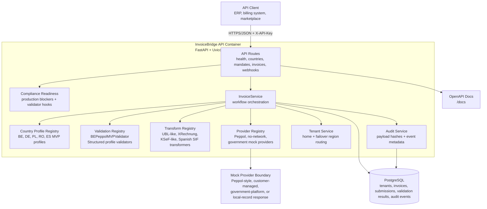
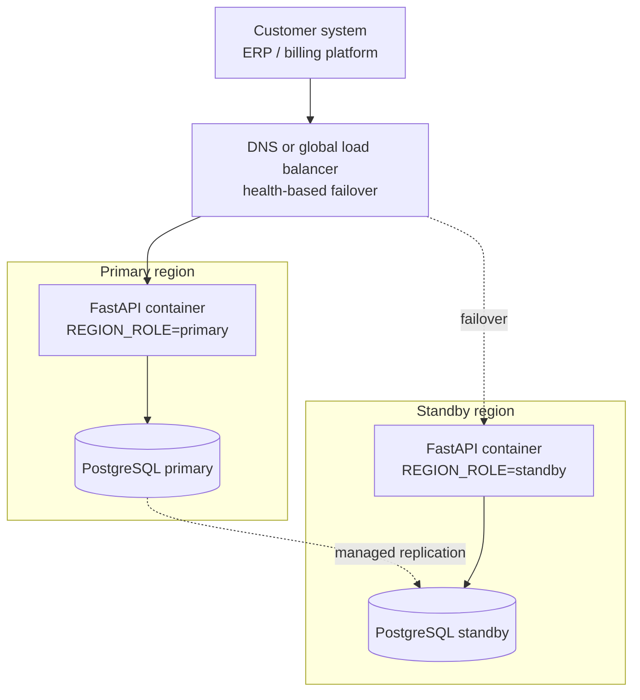

# Architecture

InvoiceBridge API is a modular FastAPI service for the e-invoicing compliance workflow: accept normalized invoice JSON, select a country mandate profile, validate compliance rules, transform valid invoices into structured outputs, submit or record through a mock provider, track status, and persist an audit trail.

The MVP supports five country profiles: Belgium B2B Peppol-style, Germany XRechnung 3.0 UBL customer-managed delivery, Poland KSeF FA(3)-style, Romania RO e-Factura/RO_CIUS-style, and Spain NON-VERI*FACTU-style local SIF record evidence. Germany is usable only when official validation passes; legal production support for the other implemented countries is coming soon. The design keeps mandate rules, validators, transformers, and providers separate so additional countries or real network providers can be added without rewriting the HTTP API.

## C4-Style Container Diagram

## Multi-Region Shape

The API is now region-aware so a customer deployment can run the same container in more than one region without changing the request contract. The recommended production architecture is single-cloud multi-region, not multi-cloud by default.

Region support is intentionally simple and customer-facing:

- `DEPLOYMENT_REGION`, `REGION_ROLE`, `DATA_RESIDENCY_REGION`, `ACTIVE_REGIONS`, and `FAILOVER_REGION` configure runtime identity.
- `/health`, `/health/ready`, and `/v1/regions` expose regional status for load balancers, smoke tests, and customers.
- `/v1/tenants` stores tenant home-region, data-residency, and failover routing policy.
- Responses include `X-Deployment-Region`, `X-Region-Role`, and `X-Data-Residency-Region`.
- Invoice, submission, and audit records persist `tenant_id` and/or `processing_region` where applicable.
- Idempotency keys remain the retry-safety mechanism during failover.

More detail is in [multi_region.md](multi_region.md) and [cloud_deployment_patterns.md](cloud_deployment_patterns.md).

## Runtime Flow

1. Client sends normalized invoice JSON to `/v1/invoices/validate`, `/transform`, or `/send`.
2. API key middleware protects `/v1` routes, resolves admin or tenant-scoped credentials, and request middleware attaches an `X-Request-ID`.
3. `InvoiceService` selects the validator through `validation/registry.py`.
4. The selected validator checks required fields, country-specific VAT/tax ID syntax and checksums where implemented, routing requirements when applicable, currency, VAT rates, line amounts, tax totals, and payable total consistency.
5. If a tenant API key is used, invoice writes are scoped to that tenant. If `tenant_id` is supplied, the service checks the tenant home/failover region before creating invoice records.
6. On validation failure, the service records an invoice record plus `invoice_received` and `validation_failed` audit events.
7. On validation success, the transformer registry selects `UBLLikeTransformer` for Belgium/Romania, `XRechnungUBLTransformer` for Germany, `KSeFLikeTransformer` for Poland, or `FiscalRecordTransformer` for Spain local SIF records.
8. Spain SIF output delegates official-field hashing, AEAT-shaped XML generation, QR payload construction, and declaration draft data to `app/services/spain_sif.py`.
9. If `SPANISH_SIF_SIGNING_COMMAND` is configured, Spain output is passed through the deployment-specific signing adapter before persistence.
10. Transform and validation outputs are persisted with audit events and SHA-256 payload hashes.
11. Transform responses include the document download URL and SHA-256 hash.
12. `/v1/invoices/{invoice_id}/document` returns the stored XML document for export/testing after transformation.
13. `/send` resolves an existing invoice or first transforms a payload, then uses the configured mock provider through the provider registry.
14. Provider responses include provider metadata, update invoice delivery status, and create `submitted`, `accepted`, `rejected`, `pending`, or `retried` audit events.
15. `/v1/compliance/production-readiness` returns explicit blockers for no-paid-network production use.
16. `/{invoice_id}/official-validate` runs the configured official validator command, persists the validator result with the document SHA-256, and never reports success when no validator is configured.
17. `/v1/invoices/{invoice_id}/spain/responsible-declaration` returns a draft evidence object for the producer declaration.
18. `/status/{invoice_id}` and `/{invoice_id}/audit-trail` expose operational state, tenant ID, processing region, and chronological evidence.
19. `/v1/invoices/{invoice_id}/archive` marks the invoice archived and can redact stored payload/XML while preserving audit hashes.

## Deployment Shape

The included single-region deployment model is Docker Compose:

- `api`: Python 3.12 slim image running Uvicorn and the FastAPI app.
- `db`: PostgreSQL 16 Alpine with a health check and persistent volume.
- Configuration is environment-driven through `pydantic-settings`.
- Alembic migrations are present; local Compose uses `AUTO_CREATE_TABLES=true` for MVP convenience.

For a production-like deployment, run Alembic migrations explicitly, set `AUTO_CREATE_TABLES=false`, inject secrets through the platform, and put TLS, request body limits, and rate limiting at the edge/gateway as well as in the app.

For hosted demos, Neon Postgres is the preferred low-cost managed database. It is configured only through `DATABASE_URL`; copied Neon `postgresql://` URLs are normalized to the installed `psycopg` SQLAlchemy driver, and `sslmode=require` plus any `channel_binding=require` parameter should remain in the connection string.

For production AWS deployments, RDS PostgreSQL remains the recommended database option when private networking, managed backups, RDS Proxy, AWS compliance controls, and predictable always-on capacity matter.

A local multi-region simulation is available through `docker-compose.multi-region.yml`. It starts two API containers with different region settings and separate PostgreSQL databases on ports `8001` and `8002`.

## Key Constraints

- Germany XML is generated as XRechnung 3.0 UBL and must pass the configured KoSIT validator before production reliance; Spain output is AEAT-shaped `RegFactuSistemaFacturacion` XML with required local SIF producer/software identity, `RegistroAlta` hash fields, event-log metadata, hash-chain, tax-breakdown, and QR payload draft data but is not AEAT-certified; other country XML remains evaluation-only output.
- Providers are deterministic mock providers, not certified access points, KSeF submissions, ANAF/SPV submissions, or Spanish SIF certification.
- Production readiness is guarded by configuration checks and official-validator command hooks, but the repository cannot supply customer credentials, legal review, or authority certification.
- The API has tenant-scoped API keys and lightweight tenant routing metadata, not a full account-management or billing model.
- Region awareness is application-level only; real production multi-region still needs managed database replication, global load balancing, secrets, observability, and tested failover.
- API key auth is intentionally simple for the MVP; production should add key rotation, expiration, per-key permissions, and secret-management controls.
- Payload size enforcement relies on `Content-Length`; production should also enforce streamed body limits upstream.
- Audit hashes support integrity checks but are not a full non-repudiation or legal archiving system.

## Extension Points

- Add mandate metadata in `app/services/country_profiles.py`.
- Add country validators in `app/services/validation/` and register them in `validation/registry.py`.
- Add format transformers in `app/services/transform/` and register them in `transform/registry.py`.
- Add routing/submission providers in `app/services/providers/` and register them in `providers/registry.py`.
- Keep route contracts stable by returning the same validation, transform, send, status, and audit response schemas.

## Primary Modules

- `app/api/routes`: HTTP endpoints and OpenAPI metadata.
- `app/schemas`: Pydantic request/response contracts.
- `app/db`: SQLAlchemy models, session factory, and Alembic migrations.
- `app/services/invoices.py`: workflow orchestration, idempotency, status, and audit coordination.
- `app/services/validation`: compliance validation rules.
- `app/services/transform`: structured e-invoice document generation.
- `app/services/providers`: network/provider abstraction.
- `app/services/audit.py`: audit event creation and payload hashing.
