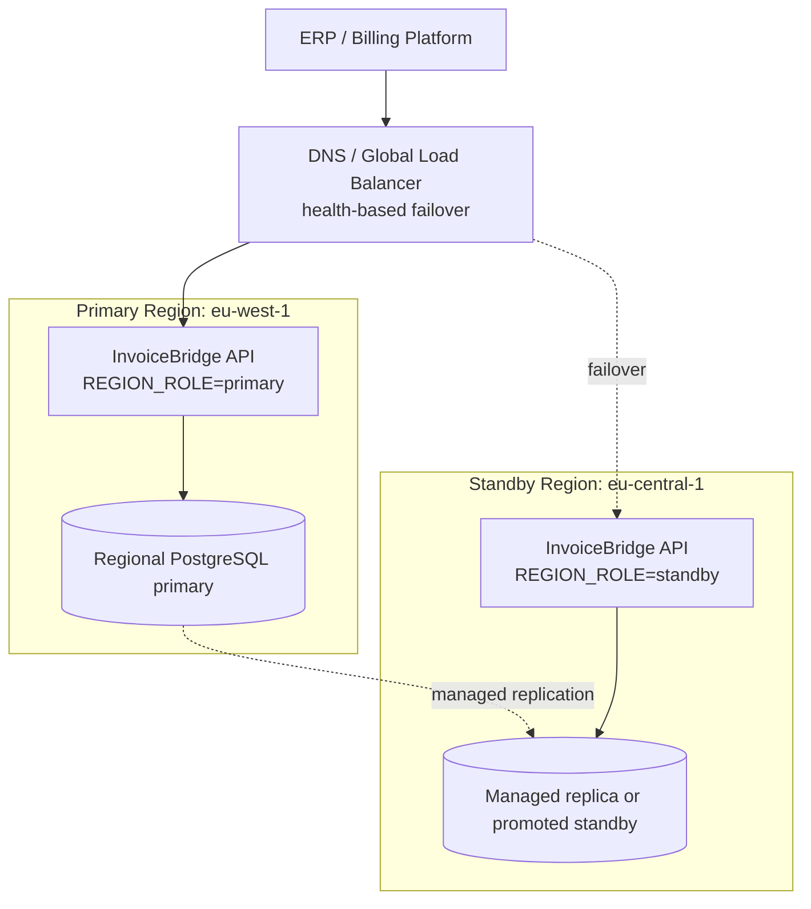

# Multi-Region Deployment

InvoiceBridge API is shaped for a single-cloud, multi-region deployment before multi-cloud. That is the right default for this product: customers care about regional availability, EU data residency, retry-safe processing, and audit continuity more than cloud-provider optionality.

This repository does not provision production cloud infrastructure. It implements the application hooks and local simulation needed for a credible multi-region deployment plan.

## Customer Requirements

| Requirement | How the API supports it |
| --- | --- |
| Region-aware tenants | Tenants store `home_region`, `data_residency_region`, and `failover_region`; invoice writes with `tenant_id` are checked against that routing policy. |
| Regional availability | Stateless FastAPI container can run in more than one region behind DNS or load-balancer failover. |
| Data residency | Runtime exposes `DATA_RESIDENCY_REGION`; invoice, submission, and audit records persist `processing_region`. |
| Audit evidence | Audit trail includes payload hashes and the region that created each event. |
| Retry safety | Transform and send flows support idempotency keys, reducing duplicate invoices during failover/retry. |
| Operational visibility | `/health`, `/health/ready`, `/v1/regions`, and response headers expose region and readiness state. |
| Controlled failover | The recommended pattern is regional-primary writes with a standby region, not active-active database writes. |
| Standby protection | New transform/send writes are rejected with `REGION_NOT_WRITABLE` unless the region role is `local`, `primary`, or `active`. |

## Runtime Region Contract

Set these environment variables per deployment:

```bash
DEPLOYMENT_REGION=eu-west-1
REGION_ROLE=primary
DATA_RESIDENCY_REGION=EU
ACTIVE_REGIONS=eu-west-1,eu-central-1
FAILOVER_REGION=eu-central-1
```

The API returns these headers on responses:

```http
X-Deployment-Region: eu-west-1
X-Region-Role: primary
X-Data-Residency-Region: EU
X-Failover-Region: eu-central-1
```

Region-aware endpoints:

- `GET /health`: liveness plus region identity.
- `GET /health/ready`: database readiness plus write-role signal.
- `GET /v1/regions`: deployment topology, write strategy, database strategy, and customer-fit notes.
- `POST /v1/tenants`: register a tenant region policy.
- `GET /v1/tenants/{tenant_id}/region-decision`: resolve whether the current region can process that tenant.
- Invoice transform/send/status/audit responses include persisted `processing_region`.
- Invoice transform/send/status responses include `tenant_id` when a tenant is supplied.
- Mutating invoice operations reject new writes from non-writable roles so a standby deployment does not accidentally create regional split-brain data.
- Mutating invoice operations with `tenant_id` reject writes outside the tenant home or failover region.

## Tenant Routing Contract

Create a tenant regional policy:

```bash
curl -s -X POST http://localhost:8001/v1/tenants \
  -H "X-API-Key: local-dev-key" \
  -H "Content-Type: application/json" \
  -d '{
    "tenant_id": "acme-eu",
    "name": "Acme EU",
    "home_region": "eu-west-1",
    "data_residency_region": "EU",
    "failover_region": "eu-central-1"
  }'
```

Then include `tenant_id` on invoice payloads:

```json
{
  "tenant_id": "acme-eu",
  "country": "BE",
  "transaction_type": "B2B"
}
```

The API uses `tenant-home-region-with-promoted-failover`: writes are allowed in the tenant home region, or in the configured failover region after that deployment is promoted to a writable role.

## Recommended Production Shape



## Why Not Active-Active Writes

Invoice workflows need strong idempotency, chronological audit trails, and predictable provider submission behavior. Active-active database writes would make conflict handling, duplicate submission prevention, and audit ordering much harder. The better MVP architecture is:

- one writable regional primary per tenant or deployment group,
- one standby/failover region,
- idempotency keys on mutating invoice operations,
- explicit promotion/failover runbook,
- region fields persisted for evidence and debugging.

## Local Simulation

Run two local API regions with separate PostgreSQL databases:

```bash
make docker-multiregion-up
```

Primary API:

```bash
curl -s http://localhost:8001/health/ready
curl -s -H "X-API-Key: local-dev-key" http://localhost:8001/v1/regions
```

Standby API:

```bash
curl -s http://localhost:8002/health/ready
curl -s -H "X-API-Key: local-dev-key" http://localhost:8002/v1/regions
```

Smoke both regions:

```bash
make smoke-multiregion
```

Tear down:

```bash
make docker-multiregion-down
```

## Failover Runbook

1. Confirm primary region failure through `/health/ready`, logs, and provider metrics.
2. Stop writes to the failing region at the global load balancer.
3. Promote the standby database or point the standby API at the promoted managed database.
4. Set standby `REGION_ROLE=primary` and update `FAILOVER_REGION` to the old primary.
5. Run smoke tests: `/health/ready`, `/v1/regions`, validate, transform, send, status, audit trail.
6. Keep idempotency keys from the client when retrying failed requests.
7. Record an operational incident note with affected region, timestamps, and provider references.

## Production Gaps

The repository now has application-level region awareness and a local multi-region simulation. A real customer deployment still needs:

- managed database replication and promotion tested in the target cloud,
- global load balancing or DNS failover,
- secrets stored in a cloud secret manager per region,
- centralized logs/metrics/traces,
- backup, restore, and disaster-recovery tests,
- production-grade account management, API-key rotation, per-key permissions, and centralized identity controls.
